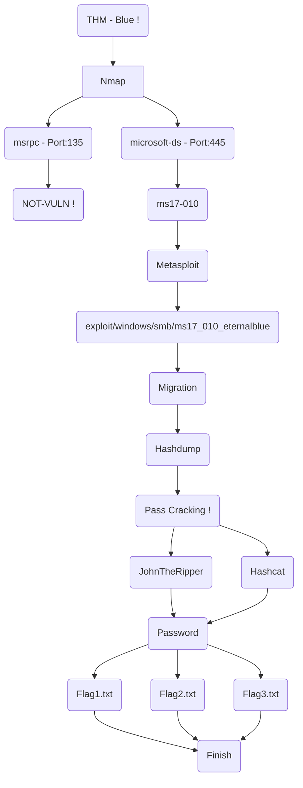

# Blue

### Nmap
- Makinenin ICMP paketlerine cevap vermediğini, buna göre nmap taramanıza gerekli parametreyi eklemeyi unutmayın.
- Port taraması gerçekleştirirken tüm portları taramanız her zaman faydanıza olacaktır.
- Nmap script taraması yapılması önerilir.
- Taramalar sonucunda açık olan bazı servisler için kullanılabilecek nmap scriptleri vardır. 
- Aşağıdaki scriptler kullanılarak zafiyet tespiti yapılabilir.

    | Port | Service       | Script Name       |
    | ---- | ------------- | ----------------- |
    | 135  | msrpc         | msrpc-enum        |
    | 443  | microsoft-ds  | smb-vuln-ms10-054 |
    | 443  | microsoft-ds  | smb-vuln-ms10-061 |
    | 443  | microsoft-ds  | smb-vuln-ms17-010 |

### Metasploit ve PrivEsc
- Öncelikle bu bölüm için temel Metasploit bilgisi kesinlikle bulunmalıdır.
- Metasploit üzerinde **hashdump**, **migrate**, **shell to meterpreter** gibi kavramlara dikkat edilmeli.
- Migrate işlemi size yetki yükseltmede işinize yarıyacaktır.
- Hashdump size kullanıcı parolalarını çekmek için yardımcı olacaktır.

### Cracking - JohnTheRipper/Hashcat
- SAM dosyası içindeki kullanıcı parolalarını kırmak için Hascat veya JohnTheRipper aracı kullanılabilir.
- John kullanan kullanıcılar için parola formatı **NT** olarak geçer.
- Hashcat kullanacak kullanıcılar ise parola format ID'si olarak **1000** değeri girilmelidir.
- Wordlist olarak öncelikle **rockyou.txt** kullanılmalıdır.

### Flag
- Sistem üzerinde 3 adet flag bulunuyor.
- THM tarafından verilen ipuçlarını takip ederek flaglere ulaşabilirsiniz.
- Flagleri almanız için migration işlemini yapmanız yeterlidir.
- Cracking işlemi öğretici olması açısından makine içine eklenmiştir.

# THM - Blue Makinesinin Akış Şeması Üzerinden Görünümü :

